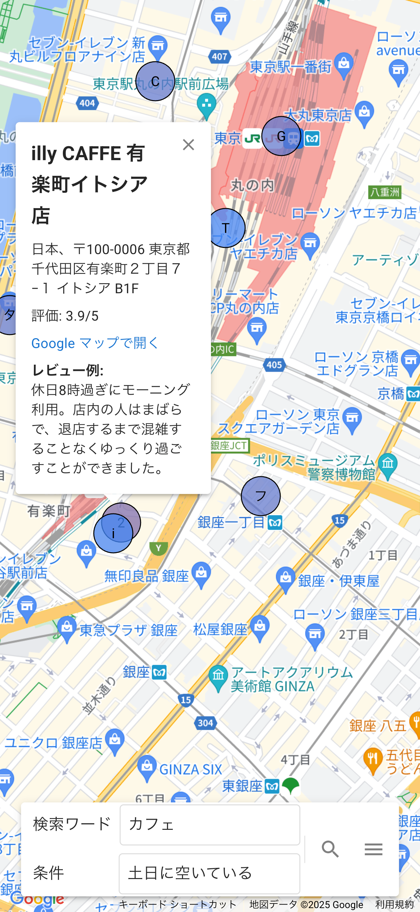

# maps_llm

## What is it?

Maps LLM is a customized Google Maps application enhanced with AI capabilities.

- Users can search for locations based on custom evaluation criteria, and visualize the results using colored map pins.

## Development and handoff

Start with the [session handoff](docs/handoff.md) for the current status and next steps. The [documentation index](docs/README.md) links the improvement plan, API limits, and historical cost audit.

