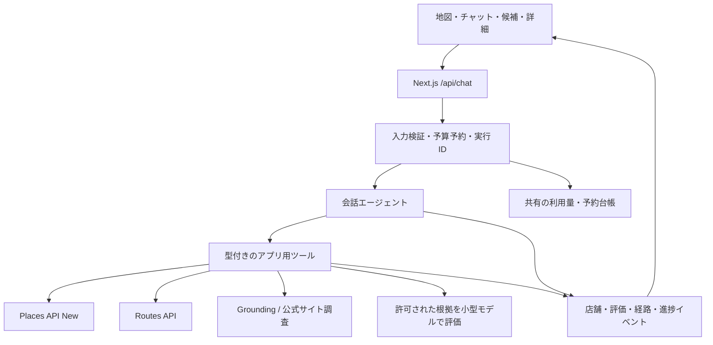

# AI Map 改善の調査・設計・実装計画

調査日: 2026-09-07。ステータス: 提案。チャット等の機能実装・有料 API の動作検証は未実施。追加の依頼により、実アカウントの料金・設定を確認し、Cloud Run の最大インスタンス数を 1 に変更した。[費用・設定の確認記録](cost-audit-2026-09-07.md)

## 1. 推奨する方針

地図を中心に、会話で検索条件を作り、候補を比較し、選んだ店を深掘りできるアプリにする。

- Next.js / React / Google Maps / Cloud Run を継続する。全面的な作り直しや別バックエンドの新設は不要。
- エージェント基盤には **Vercel AI SDK の ToolLoopAgent と AI SDK UI** を第一候補として採用する。サーバーに検索・調査ツールを定義し、結果を型付きのイベントで地図とチャットに反映する。
- 会話を担当するエージェントは 1 つ。店舗ごとの評価は、ツールを持たない小型モデルによる構造化出力として、上限付きで並列実行する。
- PC は地図の左にパネル、スマホは高さを切り替えられる下部パネル。チャット・候補一覧・店舗詳細を同じパネル内で切り替える。
- 最初に解く不確実性は **Google のデータを用いた独自採点の利用条件と根拠の取得方法**。ここを短い検証工程にし、UI 改善や通常検索の整備は独立に進める。
- 個人利用・ログイン不要を維持する。費用は AI だけでなく Maps / Web 検索 / インフラを含めて把握する。希望予算は 1 利用（10〜20 往復・約 10 tool use）あたり約 $0.20、月 5 利用で約 $1。無料枠の残量と固定費を含めて検証する。

技術選定は実装規模と UI 要件からの判断。日本の実店舗での精度・速度・請求額は未測定であり、後述の Phase 0 で検証する。

## 2. 現状の実装から分かったこと

調査対象: `src/app/page.tsx`、2 つの API route、`package.json`、`CLAUDE.md`、Docker/デプロイ設定、README の既存スクリーンショット。実ブラウザでの再現確認はまだ行っていない。

| 現状                                                                             | 影響 / 改善方向                                                                                                                                            |
| -------------------------------------------------------------------------------- | ---------------------------------------------------------------------------------------------------------------------------------------------------------- |
| `page.tsx` が 785 行で、検索・キュー・地図・吹き出し・URL 更新を担当             | 地図表示、検索実行、会話、詳細表示を分割する                                                                                                               |
| ブラウザの旧 `PlacesService.textSearch/getDetails` を使用                        | サーバーの Places API (New) アダプターへ移行する。[移行資料](https://developers.google.com/maps/documentation/javascript/legacy/places-migration-overview) |
| 検索前に評価基準の生成を待ち、候補すべての詳細を取得                             | 候補表示を先行し、必要な根拠だけ段階的に取得する                                                                                                           |
| AI 評価のみ最大 5 件ずつ処理。検索し直しても前のキュー・通信は止まらない         | 検索 ID、条件の版、キャンセル、古い結果の破棄を導入する                                                                                                    |
| `markers` と `searchResults` がそれぞれ状態を持つ                                | 店舗データからマーカーを導出し、色と詳細の不一致を防ぐ                                                                                                     |
| 座標上方へ固定配置する独自 `CustomOverlay`。端との衝突回避がない                 | 詳細をパネルへ移す。暫定修正なら標準 InfoWindow と高さ制限を検討する                                                                                       |
| Google の星と AI 条件スコアの区別が弱く、未判定や失敗の表示も曖昧                | 「Google 評価」「条件への適合」「根拠不足」「取得失敗」を区別する                                                                                          |
| `center/zoom` 状態を更新するが Map には固定の `defaultCenter/defaultZoom` を渡す | URL 復元・現在地移動が実カメラに反映されるか検証し、カメラ操作を統一する                                                                                   |
| API 入力のサイズ・型・回数・予算の検証が見当たらない                             | 有料処理の入口と各ツールで検証する。既存の予算設定は確認済みだが、希望の月 $1 を強制しない                                                                 |
| 評価 API は短い JSON に対して出力上限 10,000 tokens                              | スキーマに合わせて小さくし、使用量を記録する                                                                                                               |
| 自動テストなし。main への push で Cloud Run へ自動デプロイ                       | 移行用フラグとモック検証を用意し、段階的にリリースする                                                                                                     |

`reviews.slice(0, 50)` は 50 件を取得する指定ではない。Places API が返す口コミは最大 5 件であり、既存の `CLAUDE.md` の説明も修正対象。[Place の仕様](https://developers.google.com/maps/documentation/places/web-service/reference/rest/v1/places)

## 3. 取得できるデータと、採点の前提

### 3.1 データの取得経路を分ける

| 取得経路                             | 用途                                                                               | 制約と判断                                                                          |
| ------------------------------------ | ---------------------------------------------------------------------------------- | ----------------------------------------------------------------------------------- |
| Places API (New)                     | 店舗 ID、座標、営業時間、電話、公式サイト、写真、Google 評価、限定的な口コミの表示 | 正確なフィールド指定に向く。全口コミを検索する API ではない                         |
| Maps Grounding Lite                  | 自然文での場所調査、根拠付き回答                                                   | MCP / REST を備える LLM 向け経路。第一の検証候補                                    |
| Gemini の Grounding with Google Maps | 個店への質問、地理的な質問への回答                                                 | Google の統合経路として比較。既存 OpenAI から全面移行せず、調査アダプターとして検証 |
| 店舗公式サイト・Web 検索             | 電源設備、商品取扱、店舗告知など不足情報の補完                                     | 支店の一致、情報の日付、取得・利用条件を確認。リアルタイム在庫の保証には使わない    |

Places の `reviewSummary` は日本・日本語にも対応するが、すべての場所で返る保証はない。詳細画面での表示候補にし、Google 指定の開示・レビューリンクを付ける。独自採点へ二次利用できるという意味ではない。[レビュー要約](https://developers.google.com/maps/documentation/places/web-service/review-summaries)

Grounding Lite の `search_places` は要約と、その要約に登場する場所の ID・座標・出典を返す。生の口コミや、店舗ごとに同一項目がそろった評価表を返す API ではない。[ツールの入出力](https://developers.google.com/maps/ai/grounding-lite/reference/mcp/search_places)

Grounding Lite は車・徒歩の距離と所要時間を返すが、詳細な道順・リアルタイム交通・ナビゲーションには対応しない。経路線や比較には Routes API を別途使う。[概要](https://developers.google.com/maps/ai/grounding-lite)

Gemini の Maps grounding は個別店舗についての質問も対象とする。返答・出典の表示を維持した調査機能として比較する。[Gemini 公式資料](https://ai.google.dev/gemini-api/docs/maps-grounding)

### 3.2 独自採点はデータ利用条件を確定してから接続する

通常の Maps 規約には Google Maps Content からのコンテンツ作成の制限がある。Grounding Lite には LLM の回答生成に関する限定的な例外がある一方、出力の変更等にも制限がある。このため「Places の口コミを外部 LLM に渡し、点数化して保存できる」とは今回の資料だけでは判断しない。[基本規約](https://cloud.google.com/maps-platform/terms)、[サービス固有規約の Grounding Lite / Places の項](https://cloud.google.com/maps-platform/terms/maps-service-terms)

Phase 0 では、実際に使う契約・課金地域に対して次を確定する。

1. 取得元のデータを選定した LLM に送ってよいか。
2. 回答とは別の独自スコア・色分けへの変換が許されるか。
3. 入力、回答、採点、チャット履歴、ログ、トレースをどこまで保持できるか。
4. 店舗カードとチャットに必要な出典・投稿者・開示表示は何か。

必要なら Google に具体的なデータフローを示して照会するための質問を作る。問い合わせの送信は今回の作業には含まない。出典表示を付けるだけで利用許諾が解決したとは扱わない。

Google の Places データを一般的な TTL キャッシュやベクトル DB に蓄積する設計は採用しない。保存できる例外がある Place ID と、ユーザー自身の検索条件・メモを中心に保持し、それ以外は取得元ごとの許可を明示する。[Places の表示・保存ポリシー](https://developers.google.com/maps/documentation/places/web-service/policies)

Grounding Lite は接続先 LLM のキャッシュ・保存・学習利用にも条件を設ける。OpenAI は通常の API 入力を学習に使わないが、標準の不正利用監視ログ等の保持は別問題であり、`store: false` だけで無保持になるとは扱わない。モデル固有のキャッシュを含め、利用可能な保持設定を検証する。[Grounding Lite の接続条件](https://developers.google.com/maps/ai/grounding-lite)、[OpenAI のデータ保持](https://developers.openai.com/api/docs/guides/your-data)

許諾が確定しない場合は、公式 grounding の根拠付き回答と、利用可能な公式サイト情報による独自評価を組み合わせる。ただし、これは「Google の口コミを直接独自採点する」機能と同等ではない。核心機能のデータ源変更として明示し、未解決のまま完成扱いにしない。

### 3.3 評価は「根拠のある適合度」にする

以下はアプリ側の設計案。Google データへの適用は 3.2 の確認結果に従う。

- 「作業しやすい」を電源・静かさ・長時間利用などに分け、ユーザーが条件チップで修正できるようにする。
- 営業中・徒歩時間などの必須条件と、静かさなどの希望条件を分ける。必須条件を平均点で埋め合わせない。
- 各条件は `supported / contradicted / mixed / unknown` と、必要なら `score: 1..5 | null` を持つ。
- 根拠のない条件は null。「電源への言及なし」を「電源なし」や中間点 3 に変換しない。
- `evidenceIds`、取得元、確認日時、元情報の日付、確認できた件数を付ける。LLM が作った引用をそのまま表示せず、元データの ID に結び付ける。
- 信頼度はモデルの自己申告の確率ではなく、「公式情報」「口コミ 1 件のみ」「相反する記述あり」等のラベルにする。
- 総合点は十分な根拠のある場合だけ決定的な関数で計算する。最初は条件ごとの表示を中心にする。
- 同じ検索内では評価基準を固定する。条件を変更した場合は `criteriaVersion` を更新する。

例: 「電源ありという口コミが 1 件あります。取得できた情報だけでは席数は不明です」のように、確認範囲を自然に示す。

## 4. 追加機能の実現方法と優先順位

優先度は P1=最初の実用版、P2=次段階、P3=専用調査を伴う拡張。

| 要望・機能                                     | 実現方法                                                     | 注意点                                                                         | 優先度 |
| ---------------------------------------------- | ------------------------------------------------------------ | ------------------------------------------------------------------------------ | ------ |
| 「作業しやすいカフェは？」                     | 会話→検索語・条件・範囲を構造化→候補検索→段階評価→色付きピン | 「作業しやすい」の解釈を条件チップで見せる                                     | P1     |
| 「このカフェ、電源ある？」                     | 選択した Place ID と質問を調査ツールへ                       | 支店取り違えを防ぎ、根拠と不明点を回答                                         | P1     |
| 「三鷹駅にバーガーキングはある？」             | 三鷹駅を特定し、ブランド名で周辺検索                         | 駅構内・駅周辺を区別。0 件は「指定範囲では見つからない」                       | P1     |
| 「今営業中の家系ラーメン」                     | Text Search の `openNow` と地理条件、表示時に営業時間を確認  | 家系は検索語で扱う。営業時間不明を営業中扱いしない。「到着時も営業」は別途確認 | P1     |
| 「どっちが近い？」                             | 同じ出発点・移動手段・時刻から Route Matrix で比較           | 「徒歩 6 分 / 9 分」と実移動時間を表示。直線距離とは区別                       | P1     |
| ルート検索                                     | Routes API の線・距離・所要時間を表示。実ナビは Maps URL へ  | 最初は徒歩・車。電車は対象地域での API 検証後                                  | P1/P2  |
| 「このルートの途中でコンビニ」                 | Routes の polyline→Text Search の searchAlongRouteParameters | 候補ごとの迂回時間を比較。移動手段・経路版を固定                               | P2     |
| 「このへんでコピー用紙を買える？」             | 文具店・ホームセンター等を検索→上位候補の公式商品情報を調査  | 業態からの推定、取扱確認、当日の在庫を区別                                     | P2     |
| 「移動中の電車で、ホームセンターのある駅は？」 | 停車駅を確定→候補駅周辺検索→駅から徒歩・途中下車時間を比較   | 急行通過駅を含めない。駅データの外部 API が必要になり得る                      | P3     |
| 現在地、再検索、営業中フィルター、距離順       | 地図 UI と Places / Routes の通常処理                        | 地図移動だけでは自動で有料再検索しない                                         | P1     |
| 写真、電話、公式サイト、Google Maps で開く     | Place Details / Photos / Maps URLs                           | 写真は選択時に取得し、出典と課金を考慮                                         | P1/P2  |
| お気に入り・比較・条件付き URL 共有            | Place ID・ユーザーメモ・条件を保存                           | ログインなしでは端末間同期を前提にしない                                       | P2     |
| Street View / 交通状況レイヤー                 | Maps の対応機能を目的に応じ追加                              | 来店前の入口確認に有用。初期チャットより優先度は低い                           | P3     |
| 混雑度、全口コミのキーワード検索、棚在庫       | 今回確認した標準 API で実現を約束しない                      | Google Maps アプリで見える機能がそのまま API にあるとは限らない                | 保留   |

検索フィルター・地理指定は [Text Search (New)](https://developers.google.com/maps/documentation/places/web-service/text-search)、比較は [Route Matrix](https://developers.google.com/maps/documentation/routes/compute_route_matrix)、外部ナビは [Maps URLs](https://developers.google.com/maps/documentation/urls/get-started) を使用する。

経路沿い検索は Text Search (New) と Routes の組み合わせで実現できるが、Places の経路検索機能は公共交通に対応しない。「鉄道線のそばの店」と「降りられる駅のそばの店」を同一視しない。[経路沿い検索の仕様](https://developers.google.com/maps/documentation/places/web-service/sar-overview)

Routes の TRANSIT は経由地指定に対応しない。公開レスポンスには乗降駅・路線・停車数があるが、これだけから列車の全停車駅を列挙できるとは判断しない。駅すぱあと等の停車駅取得を検証候補とし、対象路線・料金・利用条件を確定してから選ぶ。[Transit の仕様](https://developers.google.com/maps/documentation/routes/transit-route)、[駅すぱあと API](https://docs.ekispert.com/v1/api/index.html)

日本での路線・時刻のカバレッジは実データで検証する。Google の国別カバレッジ表には公共交通の網羅性が掲載されていないため、一般の Google Maps アプリで経路が出ることだけで API 対応を断定しない。[カバレッジ資料](https://developers.google.com/maps/coverage)

## 5. エージェント基盤とモデルの選定

### 5.1 フレームワーク比較

| 候補                              | このアプリとの適合                                                                | 判断                                                                   |
| --------------------------------- | --------------------------------------------------------------------------------- | ---------------------------------------------------------------------- |
| Vercel AI SDK                     | TypeScript のツール実行ループ、構造化出力、React チャットとの型連携をまとめられる | **第一候補**。地図へのイベント反映を含む UI 主体のアプリに合う         |
| OpenAI Agents SDK                 | エージェント定義、実行・状態、ツール、観測の公式基盤                              | 有力な代替。OpenAI 中心の実行管理を優先するなら選択                    |
| LangGraph JS                      | 永続実行、再開、長い分岐ワークフローに向く                                        | 初期は見送る。長時間の旅行計画やバックグラウンド処理が増えたとき再検討 |
| OpenAI Responses API で独自ループ | 既存 SDK を活用できる                                                             | 技術的には可能だが、停止・ツール状態・UI 通信の実装量が増える          |

比較根拠: [AI SDK のエージェント](https://ai-sdk.dev/docs/agents/building-agents)、[OpenAI Agents SDK](https://developers.openai.com/api/docs/guides/agents)、[LangGraph JS](https://docs.langchain.com/oss/javascript/langgraph/overview)、[Responses API](https://developers.openai.com/api/docs/guides/migrate-to-responses)

AI SDK を採用しても、現行の Cloud Run 運用を維持する構成とする。複数の agent framework を重ねず、外部 API はフレームワークに依存しない通常の TypeScript 関数にする。MCP は接続規約であり、予算制御や検索状態を管理する基盤の代わりにはならない。

UI は既存の MUI に統一して追加する。状態は reducer + Context で開始し、同じデータを複数 store に複製しない。SDK の確定バージョンと OpenAI provider の対応は Phase 0 で最小コードをコンパイルして固定する。

### 5.2 モデルの役割

| 役割                       | 初期候補                                                         | 選定理由 / 制御                                                      |
| -------------------------- | ---------------------------------------------------------------- | -------------------------------------------------------------------- |
| 意図解釈・ツール選択・回答 | `gpt-5.6-luna` を基本、難しい依頼に `gpt-5.6-terra`              | 月 $1 の予算に合わせた改訂。品質評価を通して切替条件・回数を限定する |
| 個別評価                   | 既存の `gpt-5.6-luna`                                            | 既存実装を基準に低コストを維持。ツールなし、短い構造化出力           |
| Google 固有の調査          | Maps Grounding Lite + 適合する LLM、または Gemini Maps grounding | データ保持と根拠取得の検証結果で確定する                             |

公式価格の通常テキスト単価は、1M tokens あたり Luna が入力 $0.20 / 出力 $1.20、Terra が入力 $2 / 出力 $12。モデル ID は環境設定に分ける。モデルの能力だけでなく、このアカウントでの利用可否・出力形式・保持設定を確認する。[Luna](https://developers.openai.com/api/docs/models/gpt-5.6-luna)、[Terra](https://developers.openai.com/api/docs/models/gpt-5.6-terra)

評価 1 店あたり入力 2,000 / 出力 300 tokens と仮定すると、Luna は約 $0.00076、10 店で約 $0.0076。これは試算であり、会話・調査・キャッシュ書込等の費用は含めていない。

高価なモデルをすべての店舗に使う構成や、店ごとに自律的な Web 検索を何度も繰り返す構成は採用しない。小型モデルで根拠が不足した場合は、上位モデルによる推測より追加情報の取得を優先する。

## 6. アーキテクチャ案



### ツール契約

| ツール                 | 主な入力                       | 戻り値 / UI への作用                                      |
| ---------------------- | ------------------------------ | --------------------------------------------------------- |
| `resolve_location`     | 地名・駅名・検索地域           | 候補 ID。曖昧なら選択肢を返す                             |
| `search_places`        | 語、範囲、営業中、件数上限     | `searchId` と店舗 ID 群。候補を即表示                     |
| `evaluate_places`      | 許可済み候補 ID、条件の版      | 店舗ごとの評価状態・根拠参照。完了ごとに反映              |
| `get_place_details`    | Place ID、必要情報の用途       | 選択店舗の詳細。取得フィールドはサーバーが決定            |
| `research_place`       | Place ID、具体的な質問         | 出典付き回答 / 情報不足。地図の候補集合を勝手に置換しない |
| `compute_route`        | 出発地、目的地、移動手段、時刻 | 経路 ID・線・距離・時間                                   |
| `compare_travel_times` | 出発地、2〜5 候補、移動手段    | 同じ条件での距離・時間の比較                              |
| `search_along_route`   | 経路 ID、検索語、迂回上限      | 経路と候補の関連、追加所要時間                            |

最後のツールは P2、停車駅用ツールは P3 に追加する。ツールが作れる候補数・外部リクエスト数はサーバーの上限で決まり、LLM の引数では増やせない。

### 実行と状態

1. 送信時の地図範囲、選択店舗、現在の候補 ID、条件、移動手段をスナップショットにする。「この店」は選択店舗を入力欄のチップにも表示して明確にする。
2. 地名が明記されていれば地図範囲より優先。「このへん」は現在の地図範囲を使う。locationBias と厳密な範囲制限を区別し、実際に適用した範囲を残す。場所が特定できないときだけ短く聞き返す。
3. 検索対象のカテゴリと希望条件を分ける。最初から「静かな 電源 カフェ」に絞りすぎて候補を落とさず、必要なら別クエリを予算内で追加する。
4. 候補を先に表示し、初期評価は上位 5 店、追加操作で最大 10 店という暫定値から検証する。まだ評価していない店も消さない。
5. イベントに `runId / searchId / criteriaVersion / eventId` を付ける。店舗の確定データからピンと一覧を描画する。
6. 新規検索は前の実行を中断。既に送信済みの課金は取り消せないが、追加呼び出しを止め、到着した古いイベントを破棄する。
7. 店舗への追加質問は検索実行と区別し、チャットを畳んでも履歴・入力中の文章・選択店舗を保持する。
8. 初期は 1 リクエスト内のストリームで処理する。切断時はキャンセルし、再試行を明示する。自動再接続で同じ有料処理を再実行しない。

イベント例は `places-found / evaluation-progress / place-evaluated / route-ready / budget-exceeded / run-failed / run-finished`。モデルの自由文を解析して緯度経度やピンを作らない。外部ツールの ID とスキーマ検証を通過したデータだけを描画する。

### 保存と分割

長期保存の初期対象は、ユーザー入力・条件・お気に入り Place ID・ユーザーメモ・利用量メタデータ。取得コンテンツを含む回答履歴は取得元ポリシーに従い、無条件の localStorage 永続化も行わない。

```text
src/app/page.tsx                      画面の組み立て
src/app/api/chat/route.ts             ストリーム入口
src/features/map/                    カメラ・マーカー・経路
src/features/chat/                   会話・入力・ツール結果カード
src/features/places/                 一覧・詳細・根拠表示
src/features/search/                 条件・検索の版・UI reducer
src/server/agent/                    エージェント設定・ツール
src/server/maps/                     Places / Routes / Grounding の接続
src/server/evaluation/               根拠スキーマ・小型モデル・集計
src/server/research/                 Web 補完
src/server/budget/                   予約・精算・レート制限
src/shared/                         DTO・イベント・入力スキーマ
```

Google のクライアント専用 `LatLng` オブジェクトはサーバーとの境界で使わず、シリアライズできる数値座標にする。

## 7. スマホ / PC の UIUX

### 共通の画面構成

地図、検索条件チップ、1 つの情報パネル、現在地ボタン、「この範囲で探す」を基本にする。分布ヒストグラムは一覧の補助機能へ移し、結果件数と評価の凡例を優先する。

| 状況                   | PC                                             | スマホ                                                     |
| ---------------------- | ---------------------------------------------- | ---------------------------------------------------------- |
| 初期・地図探索         | 左 360〜420px 程度のパネルを折り畳み可能にする | 地図 + 入力欄・結果件数が見える最小の下部パネル            |
| 会話入力               | パネルのチャットタブ                           | 下部パネルを拡大。キーボード表示中は入力欄を可視領域に固定 |
| 候補表示               | チャット / 一覧タブで切替。地図は常に見える    | 半分程度の高さでカード一覧。地図を触れる余白を残す         |
| 店舗選択               | パネル内を詳細表示に切替。「一覧へ戻る」を用意 | 同じ下部パネルを詳細画面へ。別モーダルを重ねない           |
| 「この店について質問」 | 選択店舗チップ付きの入力へ                     | チャットへ切替え、対象店舗と下書きを保持                   |
| 経路表示               | 経路サマリー + 地図                            | 折り畳み時も目的地と所要時間、ナビ開始ボタンを表示         |

高さの初期案は最小 / 約 45% / 約 90% の 3 段階。ドラッグに加え「広げる・地図を見る」ボタンでも操作できるようにする。これは仮の寸法であり、実機のキーボード・ブラウザ UI を見て調整する。

ピンを選んだだけで画面全体をチャットにしない。自動で地図を動かすのは初回の結果表示・明示的な店舗選択・現在地操作を基本にし、個別評価が届くたびには動かさない。

### 表示と操作の受け入れ条件

- 詳細本文はパネル内部だけをスクロールし、閉じる・戻る・質問する操作を画面内に維持する。
- `100dvh`、safe area、ソフトウェアキーボードに対応する。320px 幅、横向き、長い店名・住所でも横にはみ出さない。
- パネルが隠す領域を地図の fitBounds の余白に反映し、選択ピンと Google の帰属表示が見えるようにする。
- 色だけで評価を伝えず「適合 / 一部適合 / 不適合 / 根拠不足」とアイコン・凡例を併記する。
- 未評価、評価中、根拠不足、取得失敗は別状態。失敗を低評価の色にしない。
- 条件への適合と Google の星評価を別ラベルで表示する。候補番号をピンとカードで合わせる。
- 「5 店中 3 店を確認済み」「停止」「未完了の店を再試行」を用意し、途中結果も利用可能にする。
- 一覧は適合度・所要時間で切替可能。更新のたびに読んでいるカードを大きく並べ替えない。
- 日本語 IME の変換確定では送信しない。入力・閉じるボタン等にラベル、フォーカス表示を付ける。`lang="ja"` にする。
- PC の Escape / Tab、スマホの戻る操作が、詳細→一覧→地図という自然な順序になる。
- 位置情報を拒否された場合も、駅名検索・地図操作で利用できる。
- 現在地移動・URL 復元・チャットの地域指定・戻る操作で、実際のカメラと検索範囲が一致する。URL 更新はカメラ移動終了時にまとめる。

## 8. 費用・速度・運用

### Maps の取得設計が費用を左右する

2026-09-07 時点の標準従量課金の最初の有料帯、1,000 件あたりの単価。無料枠・税・為替・契約割引は別。

| SKU                                   | 月間無料枠 | 有料単価 / 1,000 件 |
| ------------------------------------- | ---------: | ------------------: |
| Text Search Pro                       |      5,000 |                 $32 |
| Text Search Enterprise + Atmosphere   |      1,000 |                 $40 |
| Place Details Enterprise + Atmosphere |      1,000 |                 $25 |
| Maps Grounding Lite                   |     10,000 |                  $7 |

根拠: [Google 公式料金表](https://developers.google.com/maps/billing-and-pricing/pricing)。レビューは Atmosphere、営業時間などは Enterprise のフィールドになる。`*` を使わず、用途別に必要フィールドを固定する。[Place Details のフィールドと SKU](https://developers.google.com/maps/documentation/places/web-service/place-details)

無料枠消化後の比較例: 検索 1 回と 10 店のレビュー詳細取得は `$0.032 + 10 × $0.025 = $0.282`。一方、検索のレスポンスに必要なレビューを含められるケースでは Atmosphere の検索 1 ページが $0.040。**常に全店へ Details を発行する設計にはしない。** 同じ条件とデータ量で、検索時の一括取得と選択店のみの詳細取得を比較する。これは New API の構成例で、現行 Legacy API の請求試算ではない。

Grounding Lite もリクエストごとの料金であり、1 会話が必ず 1 リクエストで完了するとは限らない。Maps 表示・Routes・写真・Web 検索・会話モデル・Cloud Run 等を加えた合計を測定する。

### 月 $1 の個人利用に合わせた試算（予算回答を反映）

実アカウントの確認では、OpenAI Maps LLM の今月の表示額は $0.03、Google Cloud の計上済み Cloud Run 費用は無料枠適用後 ¥0。OpenAI の組織設定額は月 $100、プロジェクト個別上限は未設定、Google Cloud の既存予算は通知のみだった。集計期間・対象範囲は[確認記録](cost-audit-2026-09-07.md)を参照。以下のチャット料金は通常単価に基づく仮定計算で、実測値でも料金保証でもない。税・為替は別。

**現行の検索・評価:** 1 検索で 10〜20 店を評価し、1 店あたり入力 2,000 / 出力 300 tokens、検索語生成を入力 1,000 / 出力 200 tokens と仮定すると、Luna の AI 料金は約 $0.008〜$0.016 / 検索。月に 5 検索なら約 $0.04〜$0.08、1 利用中に 10 検索して月に 5 利用なら約 $0.40〜$0.78。現行にはチャットがないため、往復数とは直接比較しない。

現行 Legacy の無料枠は Text Search / Places Details 各 5,000 件、追加の Atmosphere Data は 1,000 件 / 月。後者は 50 検索×20 店でちょうど 1,000 件になるため、開発時の呼び出しや別アプリ分も確認する。新 API の全有料単価をそのまま現行の実請求と見なさない。[Google 料金表](https://developers.google.com/maps/billing-and-pricing/pricing)

**チャット追加後の代表例:** 20 往復 + 10 tool use に対し、会話モデルを計 30 回呼ぶと仮定する。各回平均入力 4,000 tokens（履歴・ツール定義・結果を含む）、課金対象出力 300 tokens、累計 20 店の評価、Web 検索 2 回。追加の再試行は含めない。

| 内訳                                                    | Luna を会話に使う場合 / 利用 |
| ------------------------------------------------------- | ---------------------------: |
| 会話・ツール判断: 入力計 120,000 / 出力計 9,000 tokens  |                      $0.0348 |
| 20 店の個別評価                                         |                      $0.0152 |
| Web 検索 2 回の呼び出し料                               |                      $0.0200 |
| 検索コンテンツの入力料: 追加で合計 20,000 tokens と仮定 |                      $0.0040 |
| Maps / Routes / Grounding                               |      対応する無料枠内なら $0 |
| 合計（インフラを除く）                                  |                      $0.0740 |
| 月 5 利用                                               |                      $0.3700 |

Web 検索は $10 / 1,000 呼び出しに検索コンテンツの tokens 料金が加算される。検索コンテンツの入力料は会話モデルの 120,000 tokens とは別に保守的に加算した。[OpenAI 料金表](https://developers.openai.com/api/docs/pricing)

同じ会話部分をすべて Terra にすると $0.348 となり、会話だけで $0.20 を超える。一方 Luna でも平均入力が 20,000 tokens に増えると、会話だけで $0.1308 になる。履歴の再送とツール結果の増加を計測し、会話に全店舗の口コミを繰り返し入れない。ここではキャッシュ割引を前提にしておらず、別途キャッシュ書込が発生する設定や reasoning の増加は実測で加算する。

10 tool use は 10 外部 API リクエストではない。例えば評価ツール 1 回で 20 回のモデル呼び出し、比較ツール 1 回で複数の行列要素が発生する。全検索の自動再評価は避け、今回の試算では累計評価件数を 20 店に限定した。基礎の「1 検索最大 10 店」は維持し、2 検索の合計として数える。

月 $1 の達成目標として、まず変動費を $0.10〜$0.15 / 利用、月 $0.50〜$0.75 に収め、残りをインフラ等に残す。Maps の無料枠を使い切った場合はこの見込みが成立しない。無料枠は他プロジェクト等と共有する場合があるため、残量が確認できない費用を台帳で無条件にゼロ扱いしない。

Cloud Run は実サービスで request-based（`cpuIdle=true`）・最小インスタンス未指定（既定 0）を確認した。最大数はサービス全体・リビジョンとも 1 に変更済みで、`deploy.sh` にも指定した。この利用量では実行費は無料枠内に収まる見込み。Artifact Registry の本アプリ用 `docker` リポジトリは約 0.371 GiB だが、無料枠 0.5 GiB は請求先で共有し、同じプロジェクトには別リポジトリもあるため、保管費をゼロと確定しない。転送・ログ・今後の予算台帳も含めて測定する。[Cloud Run 料金](https://cloud.google.com/run/pricing)、[Artifact Registry 料金](https://cloud.google.com/artifact-registry/pricing)

### 上限は LLM の外側で強制する

- 希望予算は約 $0.20 / 利用・約 $1 / 月。1 利用は 10〜20 往復のセッション全体と定義し、ターンごとに予算をリセットしない。月次・日次・セッション・1 実行の上限を設定可能にする。API の停止額は確認した固定費・税等の余裕を差し引いて決める。
- 外部呼び出し前に最大見込み額を予約し、実行後に精算する。並列処理と再試行も同じ台帳を通す。
- 再起動・同時リクエスト・リビジョン交代に対応できるトランザクション付きの永続台帳を使用する。最大インスタンス数 1 でも必要。GCP 内の候補は Firestore。詳細な選定は実測費用を確認して確定する。
- プロセスメモリだけのカウンターは上限管理に使わない。台帳が使えないときは新しい有料処理を開始しない。
- 暫定上限: 会話ループ 6 ステップ、検索 2 クエリ、初期評価 5 店 / 最大 10 店、評価並列 3、Web 補完は選択店または上位候補のみ 2 呼び出し、タイムアウト 45 秒。必要に応じ調整する設計値で、達成済みの性能ではない。
- 比較行列は原点数×候補数の要素数で上限管理し、初期は 1 原点×最大 5 候補とする。詳細取得・ページ送り・再試行にも別の回数上限を設ける。
- UI の停止からサーバーと外部 SDK へ AbortSignal を伝える。切断後に残る呼び出しも予算予約に含める。
- 署名付き匿名セッション、入力サイズ制限、IP 等のレート制限を併用する。ただし匿名 ID / IP は本人認証ではない。個人専用のアクセス制限を強めたい場合は別途選択する。
- ブラウザ用 Maps キーとサーバー用キーを分ける。ブラウザキーのリファラー・API 制限、サーバー資格情報の制限を設定する。
- 地図表示の費用はサーバーの AI ツール台帳だけでは抑えられない。Maps 側の利用枠も設定し、合算上限にはインフラ費用・遅延計上の余裕を取る。

Cloud Billing の「通知のみ」の予算は自動停止の仕組みではない。既存設定が何を止められるかを確認し、アプリの実行上限と区別する。[Google Cloud の予算](https://docs.cloud.google.com/billing/docs/how-to/budgets)

### Web 補完と観測

Web 検索は初期検索のすべての店舗に実行せず、Google の情報だけでは質問に答えられないときに使う。OpenAI Responses の Web search はドメイン指定と出典取得を備えるため、公式店舗サイトを優先するアダプター候補とする。[Web search](https://developers.openai.com/api/docs/guides/tools-web-search)

取得ページに含まれる指示はデータとして扱い、ツール追加・上限変更には使わせない。独自に URL 取得を実装する場合は private IP・リダイレクト・レスポンスサイズ等を制限する。

運用ログには実行 ID、API 名、SKU、件数、tokens、所要時間、終了理由、概算費用を残す。取得した口コミ・住所・正確な現在地をデバッグ目的で丸ごと記録しない。SDK の自動トレースも含めて保持ポリシーを合わせる。

## 9. 実装ロードマップ

日数は 1 人で実装・レビュー・検証する場合の作業量の目安。外部の契約確認や API 利用開始の待ち時間を含まない。全体を一度に置換せず、機能フラグで小さく切り替える。

| 段階                         | 作業                                                                                        | 完了条件                                                                                   | 目安               |
| ---------------------------- | ------------------------------------------------------------------------------------------- | ------------------------------------------------------------------------------------------ | ------------------ |
| Phase 0: 不確実性の解消      | データ利用条件整理、Grounding Lite / Gemini 比較、モデル最小実験、Maps フィールド・課金比較 | 独自採点のデータ源と保持条件が確定。5 店程度の日本語質問で根拠・店舗同定・速度・費用を記録 | 2〜4 日            |
| Phase 1: UI と通常検索の基礎 | コンポーネント分割、詳細パネル、Places New、検索 ID・キャンセル、API 入力検証、共有予算台帳 | チャットなしでもスマホ/PC で使いやすく、旧検索が混入せず、有料処理の上限が効く             | 4〜6 日            |
| Phase 2: チャット + 評価     | AI SDK、条件抽出、候補の段階表示、個別評価、店舗への質問、出典表示                          | 「検索→条件変更→店舗選択→追加質問」が一続きで動く。独自評価は Phase 0 の条件を満たす       | 5〜8 日            |
| Phase 3: 移動と補完調査      | 営業中、所要時間比較、徒歩/車ルート、経路沿い検索、商品取扱の Web 補完                      | ユーザーの具体例のうち電車の停車駅以外が、実 API と出典を伴って動く                        | 4〜7 日            |
| Phase 4: 鉄道                | 日本の公共交通 API / 停車駅データ比較、徒歩区間・途中下車後の再計算                         | 対象路線で各停/快速・方向・出発時刻を区別し、実際に降りられる駅を提案                      | 追加調査後に見積り |

Phase 1 の UI 作業は Phase 0 と並行可能。Phase 2 の画面・ツール連携も合成データで先に作れるが、Google データによる採点の有効化は Phase 0 の結論に依存する。

最初の実用版は Phase 2 までを中心とし、P1 の営業中・所要時間比較・Maps へのナビ遷移を Phase 3 から先行して組み込む。残りの経路沿い検索・Web 補完を次のリリースとする。

### 最初に切る作業単位

1. 調査の検証票: データフロー図、利用条件、5 店の質問例、費用計測欄を作る。
2. 詳細パネル導入: 吹き出しのはみ出し解消、一覧→詳細→質問の導線を合成データで確認。
3. 検索サービス分離: Places New のアダプターと DTO、検索の版、キャンセル。
4. 課金制御: 共有台帳、予約/精算、旧 API route を含む迂回防止。
5. チャットの最小縦断実装: `search_places` 1 ツールで候補表示まで通す。
6. 評価・個店調査: 根拠型、unknown、上限付き並列、部分失敗の表示を追加。

## 10. 検証とリリース条件

現在は計画書のみを変更するためアプリのテストは実行しない。実装時に追加する検証は以下に絞る。

- 単体: 条件抽出スキーマ、必須条件と希望条件、unknown の扱い、根拠 ID の実在、検索の版、費用予約の競合と精算。
- 統合: Places / Routes / LLM をモックし、ツールの選択、イベント順序、429 / timeout / 部分失敗 / 不正入力を検証。
- ブラウザ: スマホ・PC、キーボード、画面四隅の店舗、長文、パネル開閉、連続検索、キャンセル後の旧結果、位置情報拒否。
- 会話評価: 要望に挙がった 8 例と、「電源の記述なし」「口コミが矛盾」「同名の別支店」「駅構内と駅近く」「営業時間不明」「在庫未確認」等、合計 30〜50 ケース。
- 根拠や画面の CI fixture は合成データ・利用許諾済みデータを使う。Google の実口コミを評価用データセットとして無断で蓄積しない。
- 実 API のスモーク検証は別枠の費用上限内で行い、請求画面の SKU とアプリ計測を照合する。

性能の仮目標は、P95 で候補初回表示 5 秒以内、上位 5 店の評価 15 秒以内。計測開始点はユーザー送信時、終了点はそれぞれ候補描画・評価反映時。未達なら取得内容・候補数・モデル・呼び出し回数を調整し、進捗表示で待ち時間を説明する。

リリース前には lint / TypeScript / production build と上記の主要フローを確認する。新旧切替フラグでロールバックできるようにするが、旧 API route 経由で予算制限を回避できる状態には戻さない。

## 11. 残る判断事項

| 項目                                | 現在の扱い                                                                                  | 確定するタイミング     |
| ----------------------------------- | ------------------------------------------------------------------------------------------- | ---------------------- |
| 希望予算と既存上限の種類            | 約 $0.20 / 利用、約 $1 / 月。既存設定は確認済み。アプリ予算制御・SKU 無料枠残量の検証が必要 | 有料 PoC の実行前      |
| 独自採点のデータ利用・保持条件      | 推測で許可扱いにしない                                                                      | Phase 0                |
| Grounding Lite と接続先モデルの適合 | 有望だが未検証                                                                              | Phase 0                |
| 小型モデルの日本語根拠抽出精度      | Luna を基準に比較                                                                           | Phase 0〜2             |
| PC とスマホ間の履歴同期             | 初期は端末内。ログイン不要を維持                                                            | 同期が必要になったとき |
| 日本の電車・全停車駅のデータ源      | Routes + 外部 API を比較                                                                    | Phase 4 着手前         |

価格・モデル・API の提供条件は変更され得る。実装開始時には、採用する機能の公式仕様とアカウント設定を再確認する。
