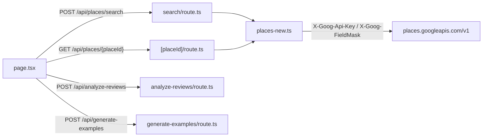

# Places API (New) サーバーアダプター

作成: 2026-09-21。引き継ぎ項目 4「Places New アダプターと API 入力検証」の設計と実装記録。実装は [src/lib/places-new.ts](../src/lib/places-new.ts)、DTO は [src/lib/place-dto.ts](../src/lib/place-dto.ts)、入力検証は [src/lib/api-schemas.ts](../src/lib/api-schemas.ts)。

**この文書の時点で実 Google / OpenAI API への呼び出しは行っていない。** 型検査、単体テスト、コードレビューで確認した範囲と、実キーで確認すべき手順を分けて記す。

## 1. 構成



| 変更前（Legacy）                                                                                                             | 変更後（New）                                                                                                        |
| ---------------------------------------------------------------------------------------------------------------------------- | -------------------------------------------------------------------------------------------------------------------- |
| ブラウザが Maps JavaScript API の `places` ライブラリを読み込み、公開キーで `PlacesService.textSearch` / `getDetails` を呼ぶ | ブラウザは Maps JavaScript API を地図とマーカーにだけ使う。Places は Next.js の route handler がサーバー用キーで呼ぶ |
| 取得フィールドをブラウザ側の `fields` 配列で指定                                                                             | FieldMask はサーバー定数。クライアントは変更できない                                                                 |
| Google の生オブジェクト（`PlaceResult`）を state に保持                                                                      | サーバーで DTO に写像した項目だけがブラウザに届く。生の応答は転送しない                                              |
| エラーは `PlacesServiceStatus` の enum                                                                                       | Google の `{ error: { code, status, message } }` を HTTP ステータスと日本語メッセージに変換                          |

### ブラウザ用キーに対する影響

- `NEXT_PUBLIC_GOOGLE_MAPS_API_KEY` は Maps JavaScript API（地図表示）だけに使う。**Places API（Legacy / New）の許可は不要**になったので、キーの API 制限から Places を外せる。
- `GOOGLE_MAPS_SERVER_API_KEY` は新設。**Places API (New) のみ許可**し、HTTP リファラー制限ではなく（サーバーから呼ぶため）API 制限で絞る。ブラウザには渡さない（`NEXT_PUBLIC_` を付けない）。
- 設定元: `.env.example`、`deploy.sh`（`--set-env-vars`）、`.github/workflows/deploy.yml`（同名の GitHub Secret `GOOGLE_MAPS_SERVER_API_KEY` を追加する必要がある）。
- Places API (New) は GCP 側で **まだ有効化されていない**（[引き継ぎ](handoff.md)）。有効化と、[API 利用制限](api-limits.md)の日次割当（Text Search 20 回、Details 100 回）の確認は実キー検証の前提。

## 2. FieldMask と SKU

SKU の対応は 2026-09-21 に次の公式資料で確認した。

- Text Search: https://developers.google.com/maps/documentation/places/web-service/text-search （「Text Search Pro SKU」「Text Search Enterprise SKU」「Text Search Enterprise + Atmosphere SKU」の各表）
- Place Details: https://developers.google.com/maps/documentation/places/web-service/place-details （「Place Details Essentials / Pro / Enterprise / Enterprise + Atmosphere」の各表）
- Review リソース: https://developers.google.com/maps/documentation/places/web-service/reference/rest/v1/places （`Review` の `text`, `rating`, `publishTime`, `relativePublishTimeDescription`, `authorAttribution`, `googleMapsUri`, `flagContentUri`）
- ネストしたサブフィールド指定（例 `places.displayName.text`）が使えること: https://developers.google.com/maps/documentation/places/web-service/choose-fields

1 リクエストの請求 SKU は、要求したフィールドのうち最上位の SKU になる（[計画書 §8](ai-map-plan.md) の料金表と同じ前提）。

### Text Search（`POST /v1/places:searchText`）

`X-Goog-FieldMask: places.id,places.displayName,places.formattedAddress,places.location,places.googleMapsUri`

| フィールド                | SKU                 | 用途                          |
| ------------------------- | ------------------- | ----------------------------- |
| `places.id`               | Essentials IDs Only | Place ID（Details のキー）    |
| `places.displayName`      | Pro                 | 店名（`.text` を使用）        |
| `places.formattedAddress` | Pro                 | 住所                          |
| `places.location`         | Pro                 | ピン座標                      |
| `places.googleMapsUri`    | Pro                 | 「Google マップで開く」リンク |

**請求 SKU: Text Search Pro**（月 5,000 件無料、以後 $32 / 1,000 件）。`places.rating` と `places.userRatingCount` は Enterprise フィールドなので検索マスクから除外した。一覧の Google 評価は Details 取得前は「—」と表示する。

リクエスト本文: `textQuery`、`locationRestriction.rectangle.{low,high}`（地図の表示範囲、`latitude`/`longitude`）、任意の `openNow`、`pageSize`（1〜20、既定 20。公式資料では `maxResultCount` は非推奨で `pageSize` が現行名。アプリの入力名は `maxResultCount` のまま）、`languageCode: "ja"`、`regionCode: "JP"`。

### Place Details（`GET /v1/places/{placeId}?languageCode=ja&regionCode=JP`）

`X-Goog-FieldMask: id,displayName,formattedAddress,location,googleMapsUri,rating,userRatingCount,currentOpeningHours.openNow,regularOpeningHours.weekdayDescriptions,websiteUri,reviews.text,reviews.rating,reviews.publishTime,reviews.relativePublishTimeDescription,reviews.authorAttribution,reviews.googleMapsUri`

| フィールド                                                                                                                                              | SKU                     | 用途                                                                      |
| ------------------------------------------------------------------------------------------------------------------------------------------------------- | ----------------------- | ------------------------------------------------------------------------- |
| `id`                                                                                                                                                    | Essentials IDs Only     | 応答の突合                                                                |
| `formattedAddress`, `location`                                                                                                                          | Essentials              | 住所、座標                                                                |
| `displayName`, `googleMapsUri`                                                                                                                          | Pro                     | 店名、Google マップリンク                                                 |
| `rating`, `userRatingCount`, `currentOpeningHours.openNow`, `regularOpeningHours.weekdayDescriptions`, `websiteUri`                                     | Enterprise              | Google 評価、件数、営業中、曜日別営業時間、公式サイト                     |
| `reviews.text`, `reviews.rating`, `reviews.publishTime`, `reviews.relativePublishTimeDescription`, `reviews.authorAttribution`, `reviews.googleMapsUri` | Enterprise + Atmosphere | 口コミ本文（OpenAI へ送る）、投稿者帰属、口コミごとの Google マップリンク |

**請求 SKU: Place Details Enterprise + Atmosphere**（月 1,000 件無料、以後 $25 / 1,000 件）。`reviews` を含む限りこの SKU になるので、サブフィールドの絞り込みは転送量を減らすだけで料金は変えない。`reviews.flagContentUri` と `reviewSummary` は今回取得しない（表示していないため。[Phase 0 検証票 §4](phase0-verification.md) では推奨項目）。

## 3. DTO（`src/lib/place-dto.ts`）

```ts
type PlaceSummary = {
  placeId;
  name;
  address;
  location: { lat; lng };
  googleMapsUri;
};
type PlaceDetail = PlaceSummary & {
  rating?;
  userRatingCount?;
  openNow?;
  weekdayDescriptions?;
  websiteUri?;
  reviews: Review[];
};
type Review = {
  text;
  rating;
  publishTime;
  relativePublishTimeDescription;
  author: { name; uri?; photoUri? };
  googleMapsUri?;
};
```

写像の規則:

- `displayName.text` → `name`、`location.latitude/longitude` → `location.lat/lng`。
- `id` または `location` を欠く検索結果はスキップし、サーバーログに警告を 1 行出す。Details で欠く場合は 502。
- `googleMapsUri` が無い場合は `https://www.google.com/maps/place/?q=place_id:{id}` を入れる（従来の UI と同じ導線）。
- 本文（`text.text`）が無い口コミ（星だけの口コミ）は DTO に含めない。OpenAI に送れず、抜粋の帰属先にもならないため。
- `author.uri` / `author.photoUri` / `review.googleMapsUri` は Google が返したときだけ設定する（`undefined` のキーは作らない）。
- 生の応答をスプレッドしない。上記以外の項目（`flagContentUri`, `name`, `originalText` 等）はブラウザに届かない。

ブラウザ側の `SearchResult`（`src/lib/place-result.ts`）は `PlaceSummary & Partial<PlaceDetail>` に評価状態を足した型。`place_id` は `placeId` に、`url` は `googleMapsUri` に改名した。

## 4. エラー変換

Google の非 2xx 応答 `{ error: { code, status, message } }` を `PlacesApiError { httpStatus, googleStatus, message }` に変換し、route handler が `{ error: { code: googleStatus, message } }` を同じ HTTP ステータスで返す。再試行や代替経路は無い。

| Google の応答                                   | クライアントへの HTTP | `error.code`                  | `error.message`                                                                                                                                                |
| ----------------------------------------------- | --------------------- | ----------------------------- | -------------------------------------------------------------------------------------------------------------------------------------------------------------- |
| 429 または `RESOURCE_EXHAUSTED`（日次割当超過） | 429                   | `RESOURCE_EXHAUSTED` 等       | 検索: 「Google Places の検索上限に達しました。時間をおいて再検索してください。」 / 詳細: 「Google Places の利用上限に達しました。…」                           |
| 400 または `INVALID_ARGUMENT`                   | 400                   | `INVALID_ARGUMENT`            | Google のメッセージ                                                                                                                                            |
| 404 または `NOT_FOUND`                          | 404                   | `NOT_FOUND`                   | 「指定された場所が見つかりませんでした。」                                                                                                                     |
| 403 / `PERMISSION_DENIED`（API 無効、キー制限） | 502                   | `PERMISSION_DENIED`           | 「Google Places API エラー (PERMISSION_DENIED): {Google のメッセージ}」                                                                                        |
| その他（5xx、JSON でない本文）                  | 502                   | `status` または `HTTP_{code}` | 「Google Places API エラー (…): …」                                                                                                                            |
| 2xx だが JSON でない                            | 502                   | `INVALID_RESPONSE`            | 固定メッセージ                                                                                                                                                 |
| `GOOGLE_MAPS_SERVER_API_KEY` 未設定             | 500                   | `MISSING_API_KEY`             | 固定メッセージ（Google は呼ばない）                                                                                                                            |
| ブラウザが中断（`request.signal`）              | 499                   | `CLIENT_ABORTED`              | 固定メッセージ（応答は届かない）。Next.js は `ResponseAborted` という独自の理由で中断するので、`signal.aborted` と例外名の両方で判定する（`src/lib/abort.ts`） |
| 上記以外の例外（DNS 失敗等）                    | 500                   | `INTERNAL`                    | 固定メッセージ。詳細はサーバーログのみ                                                                                                                         |

ブラウザ（`page.tsx`）は 429 のとき従来と同じ文言を表示し、それ以外は `error.message` があればそれを、無ければ従来の汎用文言を表示する。

OpenAI 側（`src/lib/openai-route.ts`）:

| OpenAI の例外                                        | HTTP | `error.code`                          | メッセージ                                                            |
| ---------------------------------------------------- | ---- | ------------------------------------- | --------------------------------------------------------------------- |
| `APIError` で status 429 または `insufficient_quota` | 429  | `RESOURCE_EXHAUSTED`                  | 「OpenAI の利用上限に達しました。時間をおいて再試行してください。」   |
| その他の `APIError`（接続エラー含む）                | 502  | `UPSTREAM_ERROR`                      | 「OpenAI API エラー ({status}): {message}」                           |
| 応答本文が空 / JSON でない                           | 500  | `EMPTY_RESPONSE` / `INVALID_RESPONSE` | 従来の英語メッセージ（本文は記録せず長さと `finish_reason` のみログ） |
| `finish_reason` が `length`                          | 500  | `OUTPUT_TRUNCATED`                    | 「評価結果が長すぎて途中で切れました。…」                             |
| `APIUserAbortError`（ブラウザ中断）                  | 499  | `CLIENT_ABORTED`                      | 固定メッセージ                                                        |

`max_completion_tokens` は analyze-reviews 1,000、generate-examples 1,200。`finish_reason` が `length`（出力が上限で切れた）のときは JSON 解析に進まず 500 `OUTPUT_TRUNCATED` を返す。各呼び出しで `prompt_tokens` / `completion_tokens` / `reasoning_tokens` / `finish_reason` / 所要時間をログに出す。口コミ本文、検索語、キーはログに出さない。

## 5. 入力検証（`src/lib/api-schemas.ts`、zod 4）

| ルート                        | 規則                                                                                                                                                                                                                                                                                                                                                                                                                                            |
| ----------------------------- | ----------------------------------------------------------------------------------------------------------------------------------------------------------------------------------------------------------------------------------------------------------------------------------------------------------------------------------------------------------------------------------------------------------------------------------------------- |
| `POST /api/places/search`     | `textQuery` trim 後 1〜100 文字。`rectangle.low/high` は lat −90〜90、lng −180〜180 の数値で `low <= high`（緯度・経度とも。日付変更線をまたぐ範囲は拒否）。`openNow` 任意の boolean。`maxResultCount` 整数 1〜20、既定 20。未知のキーは拒否。経度の幅は 180 度未満（Places New が `INVALID_ARGUMENT` で拒否するため）。ブラウザは送信前に `viewportToRectangle`（`src/lib/viewport.ts`）で中心を保ったまま 179.9 度に狭め、緯度を ±90 に収める |
| `GET /api/places/{placeId}`   | `^[A-Za-z0-9_-]{10,512}$`。Google は Place ID の長さを保証しないので文字種と幅のみ                                                                                                                                                                                                                                                                                                                                                              |
| `POST /api/analyze-reviews`   | `reviews` 1〜8,000 文字、`metric` trim 後 1〜200 文字、`examples` 0〜1,000 文字の**文字列**（既存のペイロードは配列ではなく「1 ... x, 5 ... y」形式の文字列）、`scale` は `"5"` のみ（省略可）。未知のキーは拒否                                                                                                                                                                                                                                |
| `POST /api/generate-examples` | `searchTerm` 1〜100 文字、`evaluation` 1〜200 文字（trim 後）。未知のキーは拒否                                                                                                                                                                                                                                                                                                                                                                 |

不正入力は 400 `INVALID_ARGUMENT` で、`{フィールド}: {理由}` を `;` 区切りにしたメッセージを返す。本文が JSON でなければ 400 `INVALID_JSON`。ブラウザは口コミ本文の連結を 8,000 文字で切ってから送る（`MAX_REVIEWS_TEXT_LENGTH`）。

## 6. 取得件数の制限（変更なし）

初期 5 店、「次の 5 件」で 5 店ずつ、1 検索あたり最大 20 店（`PlaceDetailBatch`）。検索結果は最大 20 件（`pageSize`）。`nextPageToken` によるページ送りは実装していない。

## 7. 未検証の事項

- 実キーでの Text Search / Details の成功応答、FieldMask 文字列の受理、`languageCode=ja` での口コミ翻訳の有無。
- 日次割当超過時の実際の応答（HTTP 429 と `RESOURCE_EXHAUSTED` を想定）。分単位の割当超過も同じ変換になる。
- API 未有効化・キー制限違反時の 403 `PERMISSION_DENIED` の文言。
- `request.signal` によるアップストリーム中断で、Google / OpenAI 側の課金が止まるか。
- 実ブラウザでの表示（営業時間・公式サイト・口コミごとのリンクを詳細パネルに追加した）。`e2e/` のモックはまだ Legacy の `PlacesService` を模しており、別途更新が必要。

## 8. 実キーでの確認手順

前提: GCP で Places API (New) を有効化し、`GOOGLE_MAPS_SERVER_API_KEY` を Places API (New) のみ許可したキーとして発行し、`.env.local` に設定する。割当は Text Search 20 回 / 日、Details 100 回 / 日（[API 利用制限](api-limits.md)）。以下で消費するのは検索 2 回、詳細 3 回。

1. 開発サーバーを起動し、サーバーログを見える状態にする。
2. **検索 1 回目（正常）**:

   ```sh
   curl -s -X POST http://localhost:3000/api/places/search \
     -H 'Content-Type: application/json' \
     -d '{"textQuery":"電源 カフェ","rectangle":{"low":{"lat":35.65,"lng":139.70},"high":{"lat":35.70,"lng":139.78}},"maxResultCount":5}'
   ```

   期待: 200、`{ "places": [ { placeId, name, address, location, googleMapsUri } ] }`。`rating` などマスク外のキーが無いこと。ログに `[api/places/search] status=200 duration=…ms results=N`。

3. **検索 2 回目（`openNow` と入力検証）**: 同じ本文に `"openNow": true` を足して 200 を確認したあと、`rectangle.low` と `high` を入れ替えて 400 `INVALID_ARGUMENT` が返ることを確認する（400 は Google を呼ばないので割当を消費しない）。
4. **詳細 3 回**: 手順 2 の `placeId` から 3 件を選び、

   ```sh
   curl -s http://localhost:3000/api/places/ChIJ...
   ```

   期待: 200、`reviews[]` に `text` / `author.name` / `relativePublishTimeDescription` があり、`author.uri` / `author.photoUri` / `googleMapsUri` は返った場合のみ存在。`weekdayDescriptions` が日本語であること。ログに `placeId=… reviews=N`。

5. **ブラウザ**: `http://localhost:3000` で「カフェ」「電源がある」を検索し、候補ピン → 5 件の詳細取得 → 評価まで通ること。詳細パネルで Google 評価・営業状況・投稿者・口コミリンクが表示されること。
6. **異常系（割当を消費しない）**: `GOOGLE_MAPS_SERVER_API_KEY` を空にして再起動し、検索が 500 `MISSING_API_KEY` を返し、UI にそのメッセージが出ること。キーを Places 未許可のものに差し替えた場合は 502 `PERMISSION_DENIED`（これは Google を呼ぶので検索 1 回を消費する）。
7. 確認後、Cloud Console の割当画面で Text Search / Details の使用回数が上記の回数と一致することを見る。

## 9. e2e モックが再現すべき形

- `POST /api/places/search`: 要求 `{ textQuery, rectangle: { low: {lat,lng}, high: {lat,lng} }, openNow?, maxResultCount? }`、応答 `{ places: PlaceSummary[] }`。
- `GET /api/places/{placeId}`: 応答 `PlaceDetail`（`reviews: Review[]` を含む）。
- 失敗時は全ルート共通で `{ error: { code, message } }` と対応する HTTP ステータス。429 のとき UI は固定文言、それ以外は `error.message` を表示する。
- `window.google.maps.places` のモックは不要になった。`map.getBounds().toJSON()` が `{ north, south, east, west }` を返すことは引き続き必要。
